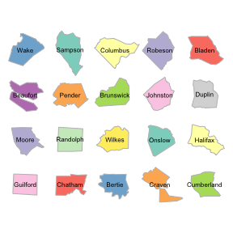

# `spatialcompare`: Create pretty comparative maps of spatial features using `sf`

<!-- badges: start -->
[](https://zenodo.org/badge/latestdoi/184946513)
[](https://travis-ci.org/tcwilkinson/spatialcompare)
<!-- badges: end -->

This R-package is designed to facilitate the construction of infographics which place spatial features side-by-side, for example to compare visually the dimensions of cities, study regions or building sizes in two dimensional space. The package aims to preserve the accurate spatial _dimensions_ and _shapes_ of the features to make them recognisable but translate their spatial _position_ so that they are distributed visually. Because spatial _dimensions_ are preserved, further spatial analysis (e.g. area calculations) or the additional of scale bars can be accurately plotted.

Functions rely on `sf` objects as inputs and outputs, hence the primary dependency of this package is `sf`. The use of `sf` objects provides maximum flexibility for ultimate graphics output; users can use base graphics or alternatives such as `ggplot` according to need or preference with the resulting reprojected and translated `sf` features.

Although theoretically any `sf`-compatible spatial features can be processed with this package, the most likely application is the orientation of polygons in a way that their relative size can be easily compared.

The original use-case was the visualization of the relative size of scientific study regions of different archaeological surveys and the relative size of ancient cities. 



## Install

You can install this directly from the github repository:-

```r
library(devtools)
install_github("tcwilkinson/spatialcompare")
```

**Read the introduction vignette for guidance on how to use this package**:

```r
browseVignettes("spatialcompare")
```
Or browse the documentation online: https://tcwilkinson.github.io/spatialcompare/


## Potential future improvements (TO DO LIST)

- Improve documentation, especially around the transformation of source spatial features which are in latlong projection in `normalizeAroundCentroid`.
- Provide alternative transformation of source features in latlong projection? (e.g. alternative target `crs`?)
- Additional `distribute` algorithms (e.g. no-fit polygon) which translate from normalized to distributed tableaus in different ways
    - `stacks` - rather than filling rows or columns, this method would stack according to certain classificatory criteria, e.g. classifying parameters such as polygon area. (`group.by`, `margin`).
    - `nofitpoly` - using methods used to enable efficient cutting out irregular polygons from materials such as cloth or metal, this method would use a user-defined buffer around polygons to find optimal translation matrices to fit all (buffered) polygons together, approximating a tesselation. (`buffer`).
- Integration with `cartogram` package.
- Convenience functions for processing and plotting as one-liner (e.g. `plot.spatialcompare`)
- (low priority:) Optimisation of code (e.g. replacement of for loops on sf objects with faster alternatives?)


## Contributions

I'm happy to accept pull requests on this package which improve the documentation and methods.

- Author: Toby C. Wilkinson
