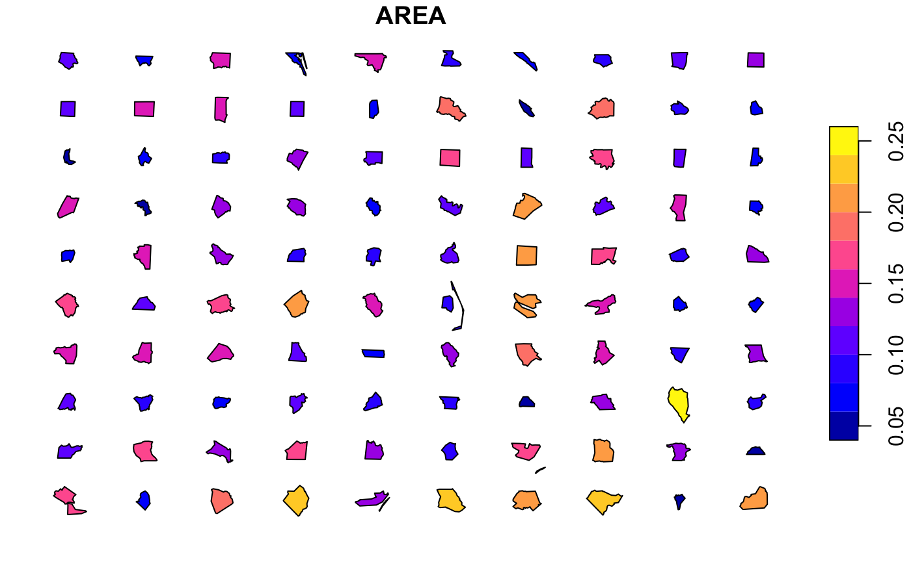

<!-- README.md is generated from README.Rmd. Please edit that file -->

<!-- use devtools::build_readme() to regenerate ; also use pkgdown::build_site() and optionally devtools::build_manual() -->

# `morphogram` 

<!-- badges: start -->

[](https://doi.org/10.5281/zenodo.2667405)
[](https://travis-ci.org/tcwilkinson/morphogram)
<!--
[](https://CRAN.R-project.org/package=morphogram) 
[](https://github.com/metacran/cranlogs.app)
[](https://github.com/metacran/cranlogs.app)
--> <!-- badges: end -->

  - Version: 0.3.0 (beta).
  - Author: Toby C. Wilkinson.
  - Date of this README document: 2019-08-01.

This R-package is designed to facilitate the construction of
“morphogram”-based infographics which place dispersed spatial
features side-by-side, for example *to compare visually the shapes or
dimensions of cities, study regions or building sizes in two dimensional
space*. The package aims to preserve recognisable or accurate **shapes**
(and by default, the linear **dimensions**) of the features to allow
human recognition, but transpose their spatial *position* so that they
are distributed in a visually understandable way. When spatial
*dimensions* are preserved, further spatial analysis (e.g. area
calculations) or the additional of scale bars can be accurately plotted.

Functions rely on `sf` objects as inputs and outputs, hence the primary
dependency of this package is `sf`. The use of `sf` objects provides
maximum flexibility for ultimate graphics output; users can use base
graphics or alternatives such as `ggplot` according to need or
preference with the resulting reprojected and translated `sf` features.

Although theoretically any `sf`-compatible spatial features can be
processed with this package, the most likely application is the
orientation of polygons in a way that their relative size can be easily
compared.

The original design use-case was archaeological, namely the
visualization of the relative size of study regions of different
archaeological surveys, ancient theatre plans and the relative size of
ancient cities.


## Installation

This package relies on the `sf` package for calculating geometries and
handling spatial data. Depending on the platform you are using, you may
need to install GDAL and other dependencies before using `sf` and
`morphogram`. Read the `sf` documentation for more information: [see sf
README on GitHub](https://github.com/r-spatial/sf/).

<!--
You cannot yet install the released version of morphogram from [CRAN](https://CRAN.R-project.org) with:

``` r
install.packages("morphogram")
```
-->

You can install the current development version of `morphogram` from
[GitHub](https://github.com/) with:

``` r
# install.packages("devtools")
devtools::install_github("tcwilkinson/morphogram")
```

## Basic Example

  - Aligning, distributing and plotting North Carolina districts as a
    grid

This example shows you how to converge, distribute and then plot a set
of simple (spatial) features using data distributed with the `sf`
package:

``` r
library(sf)
#> Linking to GEOS 3.6.1, GDAL 2.1.3, PROJ 4.9.3
library(morphogram)
#> 
#> Attaching package: 'morphogram'
#> The following object is masked from 'package:base':
#> 
#>     scale

# load polygon data from the sf package
nc <- sf::st_read(system.file("shape/nc.shp", package="sf"),quiet=T)
# converge polygons around origin
nc_converged <- converge(nc,by.feature=T)
# distribute polygons into regular grid
nc_distributed <- distribute(nc_converged, margin=1, x.mar=2)
# plot resulting distributed features
# optional: select first parameter, this is just for clarity of the final plot
nc_d <- nc_distributed[1] # AREA
plot(nc_d)
```



**For more information on how to get started, read the introduction
vignette for guidance on how to get started using this package**:

``` r
browseVignettes("morphogram")
```

Or browse the documentation and vignette online:
<https://tcwilkinson.github.io/morphogram/>

## Applications

  - City size comparison
  - Study region comparison

Do let me know if you use this package in any publications, I’d be
pleased to link to them here.

## Improvements and Contributions

For ideas and plans on how to improve this package in the future, [see
the TODO.md file](TODO.md).

Pull requests on this package which improve the documentation and
methods are welcome.

<!--
## References

-->
